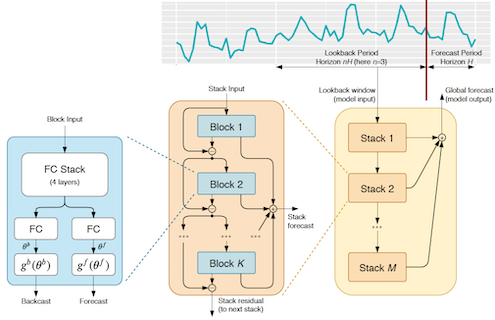

*ServiceNow completed its acquisition of Element AI on January 8, 2021. All references to Element AI in the materials that are part of this project should refer to ServiceNow.*

# N-BEATS

This repo provides an implementation of the N-BEATS algorithm introduced in
https://arxiv.org/abs/1905.10437 and enables reproducing the experimental
results presented in the paper.

N-BEATS is a neural-network based model for univariate timeseries forecasting.



## Repository Structure

#### Model
PyTorch implementation of N-BEATS can be found in `models/nbeats.py`

#### Datasets
The loaders for each dataset used in the paper are in `datasets/*.py`

#### Experiments
Experiments to reproduce the paper results are located in `experiments/*`, 
where each experiment package contains `main.py` with the training and forecasting logic along 
with two configuration files for both `generic` and `interpretable` models.

#### Results
The `notebooks` directory contains a notebook per experiment with the final scores. 
We also included the results for 10 times smaller ensembles, 
you can see that the difference is not significant.
Note: This is a "lighter" version of original N-BEATS which performs slightly different, 
sometimes better sometimes worse but overall on the same SOTA level.

#### How to reproduce the results
Make sure you have docker installed. Using NVidia GPUs is preferable, but not required.
Depending on your environment you may need to adjust Makefile's docker image name and
write additional logic to train models in parallel.

The default configuration is using 10 repeats what produces up to 180 models per experiment, as you can
see in `notebooks` the difference between big and small ensembles is not significant. 
To switch to small ensemble set `build.repeats = 1` in `*.gin` files for experiments you want to run
(they are located in `experiments/*/*.gin`).

1. Build docker image
    ```shell script
    make init
    ```

1. Download datasets
    ```shell script
    make dataset
    ```
   This command will download dataset into `./storage/datasets` directory

1. (Optional) Test metrics. To make sure that all datasets are correct and the metrics 
calculation works as expected you can run test.  
    ```shell script
    make test
    ```

1. Build an experiment
    ```shell script
    make build config=experiments/m4/interpretable.gin
    ```
   This will generate directories with configurations and command for each model of ensemble 
   in `./storage/experiments/m4_interpretable`. Note that the `config` parameter takes the **relative** 
   path to actual configuration.

1. Run experiments.
   Substitute different values for `repeat` and `lookback` in the command lines below to
   run other configurations of a model.
    
    CPU
    ```shell script
    make run command=storage/experiments/m4_interpretable/repeat=0,lookback=2,loss=MAPE/command
    ```
    GPU 
    ```shell script
     make run command=storage/experiments/m4_interpretable/repeat=0,lookback=2,loss=MAPE/command gpu=<gpu-id>
     ```
    If you have multiple GPUs on the same machine then run this command in parallel for each gpu-id.
   
    The logs, losses, snapshots and final forecasts will be stored in 
    `storage/experiments/m4_interpretable/repeat=0,lookback=2,loss=MAPE` directory.

    You can of course automate running across all experiments with the following example (assuming BASH):
    ```shell script
    for instance in `/bin/ls -d storage/experiments/m4_interpretable/*`; do 
        echo $instance
        make run command=${instance}/command
    done
    ```

    If you have resources where the training can be scaled in a "cloud", then consider adding a new target
    to the Makefile. Below is an example **in pseudo-code**:

    ```makefile
    run-all:
	rsync ${ROOT} ${network-share}
	for instance in $$(ls ${ROOT}/${experiment}); do \
		cloud submit \
				--image=${IMAGE} \
				-v ${network-share}:/experiment \
				-w /experiment \
				-e PYTHONPATH=/experiment \
				-e STORAGE=/experiment/storage \
				-- \
				bash -c "`cat ${ROOT}/${experiment}/$${instance}/command`"; \
	done
    ```
1. Get the experiment statistics.
    
    Note: If the experiment was running in a cloud make sure the results are downloaded into `storage/experiments`.
    
    Start JupyterLab `make notebook port=<port>`
    
    Run a notebook in `notebooks` directory for the corresponding experiment to get the 
    experiment's performance statistics.
 
## Citation

If you use N-BEATS in any context, please cite the following paper:

```
@inproceedings{
  Oreshkin2020:N-BEATS,
  title={{N-BEATS}: Neural basis expansion analysis for interpretable time series forecasting},
  author={Boris N. Oreshkin and Dmitri Carpov and Nicolas Chapados and Yoshua Bengio},
  booktitle={International Conference on Learning Representations},
  year={2020},
  url={https://openreview.net/forum?id=r1ecqn4YwB}
}
```

This is a collaborative work between [Element AI](https://www.elementai.com) and [Mila](https://www.mila.quebec).
Please cite the paper if you use this model or the code.
